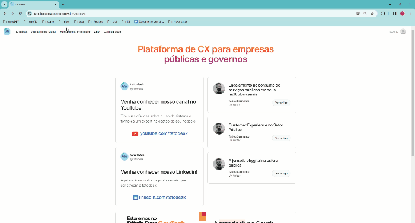
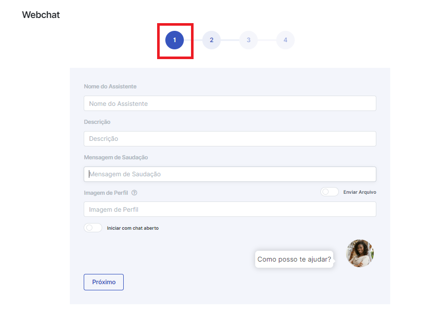
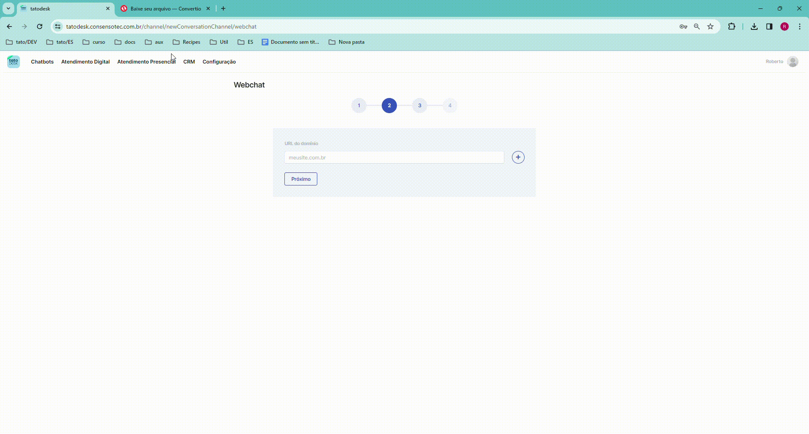
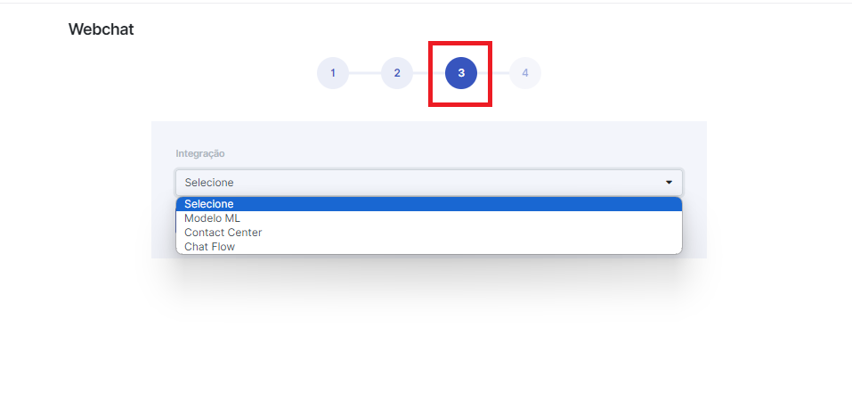

# Cadastre novo canal

---

## Cadastre um novo canal para Webchat

### Primeira etapa - Canal Webchat

Para criar um novo canal para Webchat você deve preencher os campos: 

- **Nome do Assistente:** Nome que aparecerá para o bor durante a conversa com o usurário.
- **Descrição:** Espaço descritivo que vem abaixo no nome do bot durante a conversa com usuário.
- **Mensagem de saudação:** Mensagem exibida na tela onde o bot é exposto.

### Segunda etapa - Canal Webchat

Adicione ao menos um domínio.

### Terceira etapa - Canal Webchat

Selecione a integração desejada.

- **Modelo ML**
- **Contact Center**
- **Chat Flow**

---

## Cadastre um novo canal para WhatsApp
  ### Primeira etapa - Canal WhatsApp

Para criar um novo canal para WhatsApp você deve preencher os campos: 

- **Hub:** 
- **Token:**
- **ID do Canal:** 
- **ID do Clinte:**
- **Número do WhatsApp:** 

### Segunda etapa - Canaç WhatsApp

<!--  -->

Escolha o modelo de integração que deseja associar ao canal de conversação via WhatsApp.

- **